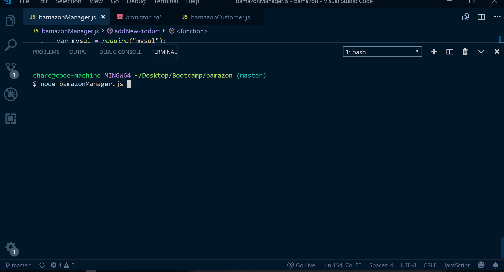

# Bamazon

This is an Amazon-like storefront that uses MySQL and NodeJS. The app will take in orders from customers and update stock from the store's inventory and provide a total cost for the customer.

## Demo - Customer
Selecting the bamazonCustomer.js file the user is shown a poduct list and given the option to buy. The item is fulfilled if there is enough inventory, then returns total cost to user and updates the SQL database. If inventory low, 'Insuficient Quantity' is displayed and is prevented from going through.

## Demo - Manager

Selecting the bamazonManager.js file user will be given four options. Selecting `View Products for Sale`, the app displays product list. Selecting `View Low Inventory`, all items with an inventory count lower than five displays. Selecting `Add to Inventory`, user will update an inventory quantity. Selecting `Add New Product`, user adds a completely new product to SQL database. Selecting `End shift and go home!` the session is terminated.

## Getting Started

In order to run this application you must have NodeJS installed on your system. A list of node packages are located in the package.json file.

## Built With

* [JS](https://developer.mozilla.org/en-US/docs/Web/JavaScript) - High-level programming language.
* [MAMP](https://www.mamp.info/en/) - Local server enviroment.
* [MySQL](https://www.mysql.com/products/workbench/) - Visual tool for database architects.
* [Node.js](https://nodejs.org/en/) - Open-source run-time environment that executes JS code outside of a browser.
* [npm](https://www.npmjs.com/) - npm is a package manager for the JavaScript programming language.
* [VSC](https://code.visualstudio.com/) - Visual Studio Code is a source code editor developed by Microsoft.
* [S>G](https://www.screentogif.com/) - Screen, webcam and sketchboard recorder with an integrated editor.

## Authors

* **Timothy Charette** - *Initial work* - [Github](https://github.com/charettetimothy)

## Acknowledgments

* Hat tip to anyone whose code was used.