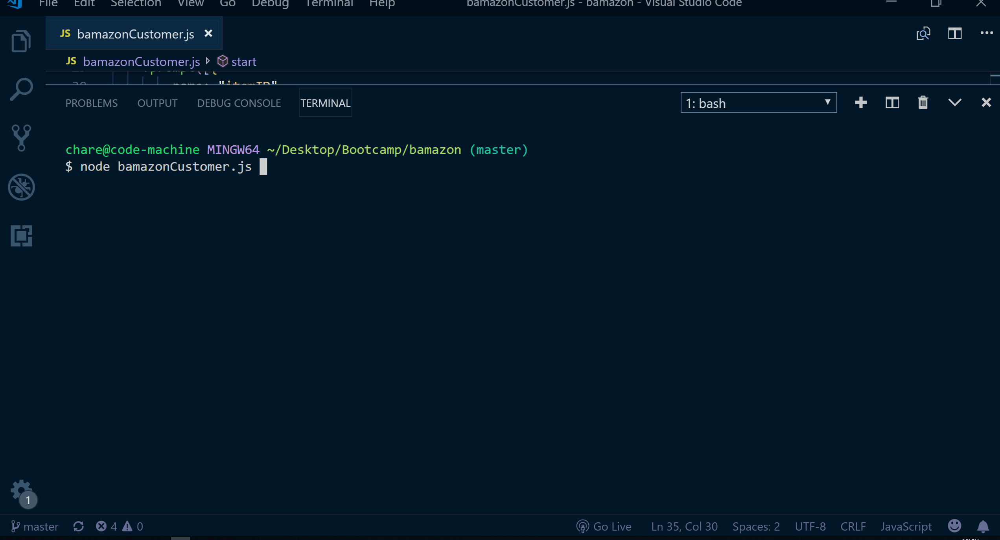

# Bamazon

This is an Amazon-like storefront that uses MySQL and NodeJS. The app will take in orders from customers and update stock from the store's inventory and provide a total cost for the customer.

## Demo

## Getting Started

In order to run this application you must have NodeJS installed on your system. A list of node packages are located in the package,json file.

## Technologies Used

- NodeJS
- JavaScript
- npm (inquirer, console.table, mysql)

## Built With

* [MAMP](https://www.mamp.info/en/) - Local server enviroment.
* [MySQL](https://www.mysql.com/products/workbench/) - Visual tool for database architects.
* [Node.js](https://nodejs.org/en/) - JavaScript run-time environment.
* [npm](https://www.npmjs.com/) - npm is a package manager for the JavaScript programming language.

## Authors

* **Timothy Charette** - *Initial work* - [charettetimothy](https://github.com/charettetimothy)

## Acknowledgments

* Hat tip to anyone whose code was used
* Inspiration
* etc